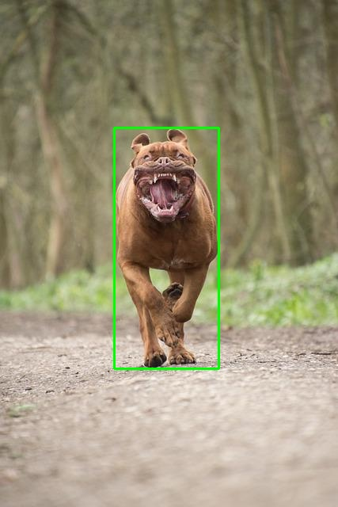

# Inter-Process Communication: Shared Memory Between C and Python


## Project Developer Information

**Name:** Shoumik Barman Polok
**Roll:** 2007004 
**Section:** B
**Year:** 4th  
**Term:** 2nd  


This project demonstrates inter-process communication (IPC) using POSIX shared memory to enable data sharing between a C program and a Python program. It shows how two different processes written in different languages can efficiently share structured data through shared memory.

## What This Project Demonstrates

This is fundamentally an IPC project that showcases:
- **Cross-language communication**: Sharing data between C and Python programs
- **POSIX shared memory**: Using `shm_open()` and `mmap()` for fast, low-overhead data sharing
- **Structured data exchange**: Passing complex data structures (arrays of detection objects) between processes
- **Memory-mapped files**: Understanding how shared memory segments work across process boundaries
- **Process decoupling**: Allowing processes to run independently while sharing data

The object detection example provides a real-world use case, but the techniques demonstrated here apply to any scenario where you need to share data between processes.

## IPC Workflow

he communication pattern follows a producer–consumer model:

Producer (C Program)
The C program (ipc_dog_yolov4.c) performs dog detection using YOLOv4-tiny, creates a POSIX shared memory segment, and writes structured detection data (class ID, confidence score, and bounding box coordinates) into shared memory.

Shared Memory
A named POSIX shared memory segment (/ipc_dog_shm) is used as the communication medium.
This shared memory persists independently of process execution and can be accessed by any process that knows its name.

Consumer (Python Program)
The Python program (ipc_dog_reader.py) opens the same shared memory segment, reads the detection data using compatible structure definitions (ctypes), and visualizes the results by drawing bounding boxes on the input image.

This workflow demonstrates a key IPC principle: the producer and consumer do not need to run simultaneously.
The shared memory segment allows asynchronous communication, enabling independent execution of the C detection process and the Python visualization process.

## Project Structure

```
ipc-dog-detection/
├── ipc_dog_yolov4.c        # C program (YOLOv4-tiny detection + shared memory writer)
├── ipc_dog_reader.py      # Python program (shared memory reader + visualization)
├── dog.jpg                # Input image for detection
└── ipc_dog_out.jpg        # Output image with bounding box drawn
```

## Example Results

Here's what the input image looks like:


And here's the output after detection and visualization:



The green boxes show detected objects with their confidence scores.

## Requirements

### For the C Program

- C compiler (gcc recommended)
- Darknet library compiled as a shared library (for YOLOv4-tiny)
- YOLOv4-tiny configuration file (yolov4-tiny.cfg)
- YOLOv4-tiny weights file (yolov4-tiny.weights)
- COCO class names file (coco.names)
- POSIX shared memory support (available on Linux, WSL, and macOS)

### For the Python Program

- Python 3.x
- OpenCV (`cv2`) - install with `pip install opencv-python`
- Standard library modules: `mmap`, `ctypes`, `os`

## Building and Running (WSL Environment)

This project is built and executed inside Windows Subsystem for Linux (WSL) using Darknet compiled as a shared library.

## Step 1: Build Darknet as a Shared Library

Inside the Darknet directory:

```bash
nano Makefile
```

Set:

```makefile
LIBSO=1
```

Then build:

```bash
make clean
make
```

Verify:

```bash
ls | grep libdarknet.so
```

## Step 2: Compile the C IPC Program

```bash
gcc ipc_dog_yolov4.c -o ipc_dog_yolov4 \
    -Iinclude \
    -L. -ldarknet \
    -lm -pthread

```

## Step 3: Run the C Program (Producer)

```bash
export LD_LIBRARY_PATH=.
./ipc_yolov4 dog.jpg
```

Expected output:

```text
Detections written to shared memory. Count = X
```

## Step 4: Run the Python Program (Consumer)

```bash
python3 ipc_dog_reader.py
```

The output image will be saved as:

```text
ipc_dog_out.jpg
```


### Shared Memory Mechanism

This project uses POSIX shared memory, which provides:
- **Named segments**: Memory accessible by a filesystem-like name (`/ipc_dog_shm`)
- **Persistence**: Memory remains available even after the creating process exits
- **Zero-copy efficiency**: Data is accessed directly from memory without serialization overhead
- **Cross-process access**: Multiple processes can map the same segment into their address spaces

### Data Structure Synchronization

For IPC to work correctly, both programs must use identical data structures. This is critical - any mismatch will cause data corruption or incorrect interpretation:

**Detection Structure:**
- `class_id`: The class of the detected object (0 for person in COCO dataset)
- `confidence`: How confident the detection is (0.0 to 1.0)
- `x, y`: Top-left corner coordinates of the bounding box
- `w, h`: Width and height of the bounding box

**Shared Data Structure:**
- `count`: Number of detections found (up to MAX_BOXES = 10)
- `det`: Array of Detection structures

### C Program IPC Implementation

The C program (`ipc_dog_yolov4.c`) demonstrates the producer side of IPC:

**Shared Memory Creation:**
- `shm_open(SHM_NAME, O_CREAT | O_RDWR, 0666)`: Creates or opens a named shared memory object
- `ftruncate(shm_fd, sizeof(SharedData))`: Sets the size of the shared memory segment
- `mmap()`: Maps the shared memory into the process's virtual address space with read/write permissions

**Data Writing:**
- Structures are written directly to the mapped memory region
- No serialization needed - the memory layout matches the C structure definition
- The shared memory segment persists after the program exits (until explicitly unlinked)

**IPC Key Points:**
- The segment name (`/ipc_dog_shm`) must match exactly in both programs
- Memory is zero-initialized before writing to ensure clean state
- The producer doesn't need to wait for the consumer - data is available asynchronously

### Python Program IPC Implementation

The Python program (`ipc_dog_reader.py`) demonstrates the consumer side of IPC:

**Shared Memory Access:**
- Opens the shared memory file from `/dev/shm` (Linux) where POSIX shared memory objects appear
- Uses `mmap.mmap()` to map the segment into Python's address space
- Uses `ctypes.Structure` to define structures that match the C definitions exactly

**Data Reading:**
- `SharedData.from_buffer_copy(shm)`: Creates a Python object from the raw memory buffer
- Field access is direct - no parsing or deserialization required
- The `ctypes` library handles the binary compatibility between C and Python structures

**IPC Key Points:**
- Structure field order, types, and sizes must exactly match the C definitions
- The consumer can read the data at any time after the producer writes it
- Memory is accessed read-only to prevent accidental modification


### Detection Filtering

Currently, the C program only processes detections where:
- `class_id == 0` (person class in COCO dataset)
- `confidence > 0.5`

You can modify these thresholds in `ipc_yolov4.c` at lines 102-103 to detect other classes or adjust the confidence threshold.

## Customization

### Detecting Other Object Classes

To detect objects other than people, modify the condition in `ipc_dog_yolov4.c`:

```c
// COCO class ID 16 corresponds to "dog"
int dog_id = 16;

if (dets[i].prob[dog_id] > thresh) {
    // process detection
}

```

### Adjusting Confidence Threshold

Change the `thresh` variable (currently 0.5) to be more or less strict:

```c
float thresh = 0.5;  // Lower = more detections, Higher = fewer but more confident
```

### Changing Maximum Detections

Modify `MAX_BOXES` in both files if you need to detect more objects:

```c
#define MAX_BOXES  10  // Increase this number
```


## IPC Use Cases and Applications

The shared memory IPC pattern demonstrated here is valuable for:

**Performance-Critical Systems:**
- When you need C/C++ performance for computation but Python's flexibility for other tasks
- Real-time systems where low latency communication is essential
- High-throughput data processing pipelines

**Process Architecture:**
- Microservices that need to share state or results
- Producer-consumer architectures with decoupled processes
- Systems where processes may start and stop independently

**Cross-Language Integration:**
- Integrating legacy C/C++ codebases with modern Python applications
- Sharing data between different runtime environments
- Building polyglot systems that leverage each language's strengths

**Resource Efficiency:**
- Embedded systems where memory efficiency matters
- Avoiding serialization overhead (no JSON, protobuf, or message queues needed)
- Zero-copy data sharing for large datasets

**Development Workflow:**
- Separating computation from visualization for easier debugging
- Allowing different teams to work on different parts of a system
- Enabling independent deployment of producer and consumer processes


## License and Credits

This project demonstrates inter-process communication techniques using POSIX shared memory. The object detection example uses YOLOv4-tiny from the Darknet framework.
